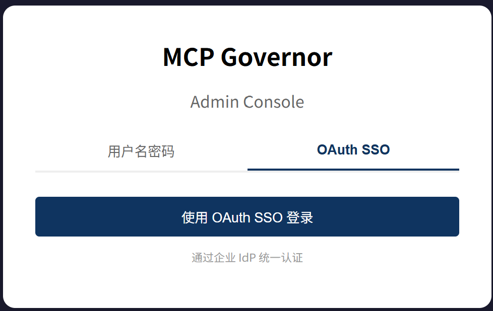

# MCP Governor 部署指南

## 前置条件

- Docker 20.10+
- Docker Compose v2+
- 4GB+ 可用内存

## 完整部署

包含 Prometheus 监控、Langfuse LLM 追踪和 Admin UI 管理界面：

### 1. 配置环境变量

```bash
git clone https://github.com/OntarioLT/mcp-governor.git
cd mcp-governor
cp .env.example .env
```

编辑 `.env`，填入 LLM API Key：

```env
LLM_API_KEY=sk-your-key-here
```

### 2. 启动服务

```bash
docker compose up -d
curl http://localhost:7680/health
# 期望输出: {"status":"ok","version":"1.0.0"}
```

### 3. 访问 Admin UI

浏览器打开 http://localhost:8080 即可访问管理界面（默认账号密码：admin/admin）。

**Admin UI 功能一览：**

| 页面 | 功能 |
|------|------|
| **Tools** | 查看已注册工具、注册 MCP Server / REST API、一键安装预配置集成（GitHub/Slack/高德等 10+ 模板） |
| **Agents** | 查看和编辑 Agent 配置（allowed_tools、rate_limit），修改后立即生效 |
| **Policies** | 角色管理、工具权限配置、敏感工具白名单、策略测试 |
| **Monitoring** | 实时监控面板（Prometheus 指标） |
| **Audit Log** | 审计日志表格（trace_id / tool / action / agent / latency） |

### 4. 停止服务

```bash
docker compose down
```

### 服务端口

| 服务 | 端口 | 说明 |
|------|------|------|
| MCP Governor | 7680 | API Gateway |
| OPA | 8181 | 策略引擎 |
| ERP API | 9003 | 库存服务（Demo） |
| CRM API | 9002 | 客户服务（Demo） |
| Prometheus | 9090 | 指标监控 |
| Langfuse | 3001 | LLM 追踪 |
| Admin UI | 8080 | 管理界面（含监控面板） |

## 企业版部署

企业版提供完整的商业功能，参见 [README.md — Editions](README.md#editions)。

### 前置条件

1. 从商务获取 License Key
2. 获取阿里云 ACR 访问权限

### 部署步骤

#### 1. 登录阿里云 ACR

```bash
# 使用 RAM 子账号登录（联系商务获取账号密码）
docker login --username=mcp-governor@<your-account-id> crpi-zv48h6itqo28pfxd.cn-hangzhou.personal.cr.aliyuncs.com
```

#### 2. 配置环境变量

```bash
cp .env.example .env
```

编辑 `.env`，添加 License：

```env
LLM_API_KEY=sk-your-key-here
MCP_GOVERNOR_LICENSE=<your-license-key>
```

#### 3. 启动服务

```bash
docker compose -f docker-compose.enterprise.yml up -d
```

#### 4. 验证企业版

```bash
curl -s http://localhost:7680/config/enterprise
# 期望输出: {"enterprise": true, "features": {"oauth": true, ...}}
```

#### 5. 停止服务

```bash
docker compose -f docker-compose.enterprise.yml down
```

#### 6. 配置 OAuth SSO（可选）

企业版 Admin UI 支持 OAuth 2.1 / OIDC SSO 登录，需要配置 IdP 信息。



##### 6.1 配置 Keycloak

**创建 Client**

1. Keycloak Admin Console → Clients → Create client
2. Client type: OpenID Connect
3. Client ID: `mcp-governor`
4. Valid redirect URIs: `http://localhost:7680/auth/oauth-callback`

**创建 Realm Role**

1. 左侧菜单 → Roles (Realm roles) → Create role
2. 创建 `realm-admin`（管理员）和 `realm-user`（普通用户）

**分配角色给用户**

1. Users → 选择用户 → Role mappings → Assign role
2. 管理员分配 `realm-admin`

**配置 Role 进入 id_token**

1. Client Scopes → `mcp-governor-dedicated` → Mappers → Create mapper
2. Name: `realm-roles`
3. Type: User Realm Role
4. Token Claim Name: `realm_access.roles`
5. Add to ID token: **ON**
6. Add to access token: **ON**

##### 6.2 修改 Gateway 配置

编辑 `config/oauth.yaml`，添加 IdP 配置：

```yaml
providers:
  - name: keycloak
    issuer: http://host.docker.internal:8083/realms/mcp-governor
    client_id: mcp-governor
    client_secret: <your-client-secret>
    role_mapping:
      realm-admin: admin
      realm-user: user
```

> **issuer 填写说明：** Keycloak 等标准 OIDC Provider 只需填写 `issuer` + `client_id` + `client_secret`，`introspection_url` 和 `userinfo_url` 通过 OIDC Discovery 自动发现。issuer 地址取决于部署方式：
>
> | 部署方式 | issuer |
> |---------|--------|
> | Docker Desktop (Win/Mac) | `http://host.docker.internal:8083/realms/mcp-governor` |
> | Docker on Linux | `http://172.17.0.1:8083/realms/mcp-governor` |
> | 裸机 / 非容器 | `http://localhost:8083/realms/mcp-governor` |
> | 远程 Keycloak | `http://<keycloak-ip>:8083/realms/mcp-governor` |

##### 6.3 配置环境变量

在 `.env` 中添加：

```
KEYCLOAK_CLIENT_ID=mcp-governor
KEYCLOAK_CLIENT_SECRET=<your-client-secret>
```

##### 6.4 重启 Gateway 并验证

```bash
docker compose -f docker-compose.enterprise.yml up -d mcp-governor

# 检查 OAuth SSO 是否可用
curl -s http://localhost:7680/auth/oauth-config
# 期望输出: {"available": true}
```

启用后，Admin UI 登录页将显示"OAuth SSO"选项卡。只有拥有 `realm-admin` 角色的用户才能通过 SSO 登录 Admin UI。

## 对接 AI Agent

详见 [README.md — External Platform Integration](README.md#external-platform-integration)。

## 常见问题

### Gateway 连接后端失败

确保 ERP/CRM 服务已启动：

```bash
curl http://localhost:9003/health
curl http://localhost:9002/health
```

### JWT 认证失败

确保使用正确的 JWT Secret（默认: `dev-secret-change-me`）。
