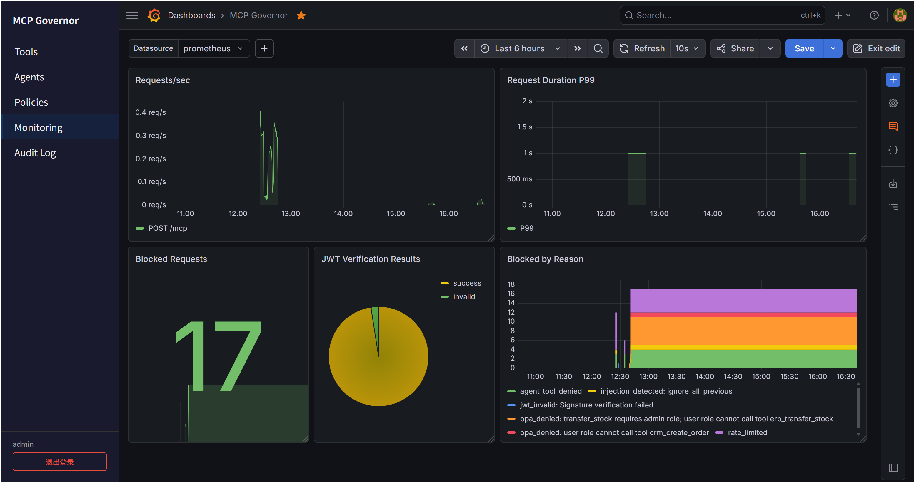

# MCP Governor

> **AI 工具的统一治理中枢** — 让企业安全、合规、可控地接入 AI Agent 能力

[](https://www.python.org/downloads/)
[](LICENSE)

## Why MCP Governor?

你的 AI Agent 正在调用内部 ERP、CRM、外部地图等工具，你却未必掌握全局：

- 🔓 **权限边界在哪？** — Agent 是否会越权访问高管薪酬、核心客户数据等敏感资源？
- 🔓 **敏感数据是否泄露？** — 客户手机号、身份证号是否在调用链路中明文传输？
- 🔓 **事后能否溯源定责？** — 调用异常时，能否精准回溯操作主体、调用链路与拦截原因？

MCP Governor 正是为解决这三大核心风险而生：作为AI Agent与企业内外部资源之间的安全网关，**原生适配MCP协议，无需改造现有Agent与业务系统**，统一纳管REST/gRPC/MCP等多协议接入，提供注入防护、PII自动脱敏、全链路审计追溯能力，帮企业在释放AI生产力的同时，守住数据安全与合规底线。

**企无缝连接内外部生态，赋予 AI Agent 真正的执行力；依托企业级安全治理，实现一键可信部署。**



## Quick Start

```bash
git clone https://github.com/OntarioLT/mcp-governor.git
cd mcp-governor
cp .env.example .env && vim .env   # 填入 LLM_API_KEY
docker compose up -d
curl http://localhost:7680/health  # → {"status": "ok"}
```

> 详细部署说明请参考 [DEPLOYMENT_GUIDE.md](DEPLOYMENT_GUIDE.md)

## Core Capabilities

### 🛡️ 安全治理

| 能力 | 说明 |
|------|------|
| **注入防护** | 848 条 Aho-Corasick 规则（7 类别），覆盖 prompt 注入、间接注入、编码绕过、中文越狱 |
| **PII 脱敏** | 自动识别并屏蔽身份证、手机号、银行卡、邮箱（中文正则，< 3ms） |
| **审计追溯** | 结构化审计日志 + Agent 身份 + Langfuse LLM 调用追踪（Enterprise: Ed25519 签名链） |
| **零信任鉴权** | JWT + API Key + OAuth 2.1/OIDC + OPA 策略引擎，按 Agent/角色控制工具访问 |
| **Agent 隔离** | 按 Agent 名称（allowed_tools）和角色（OPA Rego 策略）双重过滤，最小权限原则 |

### 🔌 协议适配

| 能力 | 说明 |
|------|------|
| **REST → MCP** | 零配置将 REST API 动态代理为 MCP tools（支持 OpenAPI 自动发现） |
| **gRPC → MCP** | .proto 反射生成 manifest + 运行时 gRPC 代理 |
| **Streamable HTTP** | MCP 2025-03-26 标准传输，向后兼容 SSE |
| **10+ 预配置集成** | 高德/钉钉/微信/飞书/GitHub/Slack/Notion 等 |

## Demo

### 快速体验（推荐）

```bash
cd mcp-governor
cp .env.example .env  # 不需要LLM_API_KEY
docker compose -f docker-compose.min.yml up -d
./demo/docker-demo.sh
```

无需 Python 环境和 LLM API Key，只需 Docker 即可体验注入检测、PII 脱敏、OPA 策略等核心功能。

完整场景部署详见 [DEPLOYMENT_GUIDE.md](DEPLOYMENT_GUIDE.md)

### 完整场景（需要 LLM）

| 分类 | # | 场景 | 效果 |
|------|---|------|------|
| **工具路由** | 1 | 统一接入 | LLM 调用内部 ERP 查询库存，返回真实数据 |
| | 2 | 多源聚合 | CRM + ERP + AMAP 距离计算，就近仓库发货 |
| | 3 | REST 虚拟化 | 零配置 REST API → MCP tools |
| **安全防护** | 4 | 注入防护 | 848 条规则拦截恶意 prompt 注入攻击 |
| | 5 | PII 脱敏 | 客户手机号/邮箱自动屏蔽 |
| **权限控制** | 6 | OPA 策略 | 非 admin 角色调用 `transfer_stock` 被拦截 |
| | 7 | Agent 隔离 | hr_agent 被拒（工具无授权），user 角色被拒（无写权限） |
| | 8 | 用户级控制 | 敏感工具按 user_id 白名单控制 |
| **可观测性** | 9 | 审计追溯 | 结构化日志含 Agent 身份 + 调用轨迹 |
| | 10 | 可观测性 | 实时监控面板（Prometheus 指标） |
| **流量控制** | 11 | 限流 | Token Bucket 限流（per-agent + per-tool） |

## Why Us?

| | MCP Governor | ContextForge (IBM) | AgentGateway |
|---|---|---|---|
| **注入防护** | ✅ 开箱即用 848 条规则 | ⚠️ 需自定义正则/插件 | ⚠️ 依赖外部 Guardrails |
| **中文 PII 脱敏** | ✅ 身份证/手机/银行卡 | ⚠️ 通用 PII，需调优 | ❌ 无内置中文规则 |
| **本土生态** | ✅ 钉钉/飞书/微信/高德 | ❌ 无国内 SaaS | ❌ 无国内 SaaS |
| **REST/gRPC → MCP** | ✅ 零配置动态代理 | ⚠️ 需手动配置 | ⚠️ 支持 OpenAPI |
| **细粒度鉴权** | ✅ Agent 名称 + OPA 双重隔离 | ⚠️ 标准 RBAC/SSO | ⚠️ CEL 策略引擎 |
| **审计与追溯** | ✅ Agent 身份 + Langfuse LLM 追踪 | ⚠️ 基础日志 + OTLP | ⚠️ 仅 OTLP |

**MCP Governor 的独特定位**：开箱即用的安全治理 + 本土化中文生态。对企事业单位而言，无需二次开发即可实现 AI 工具的合规管控。

## Editions

| 功能 | Community（社区版） | Enterprise（企业版） |
|------|---------------------|----------------------|
| **注入防护** | ✅ 848 条 Aho-Corasick 规则 | ✅ 同社区版 |
| **PII 脱敏** | ✅ 身份证/手机号/邮箱/银行卡 | ✅ 同社区版 |
| **审计追溯** | ✅ 结构化日志 + Agent 身份 | ✅ + Ed25519 签名链 |
| **鉴权** | ✅ JWT + API Key | ✅ + OAuth 2.1 Token Introspection + Admin SSO |
| **OPA 策略** | ✅ 角色权限控制 | ✅ 同社区版 |
| **REST → MCP** | ✅ 零配置动态代理 | ✅ 同社区版 |
| **gRPC → MCP** | ✅ 自动适配 | ✅ 同社区版 |
| **Langfuse 追踪** | ✅ LLM调用轨迹 | ✅ 同社区版 |
| **外部平台集成** | ✅ 直连Gateway | ✅ 同社区版 |
| **Admin UI** | ✅ 基础管理界面 | ✅ + Policies + Monitoring |
| **Chain Detector** | ❌ | ✅ 链路风险检测 |
| **License 校验** | ❌ | ✅ 企业版 License |
| **全场景 DEMO** | ❌ | ✅ Python 示例 |
| **企业场景定制** | ❌ | ✅ 按需定制 + SLA |
| **源码** | ❌ 闭源分发 | ❌ 闭源分发（可选购源码授权） |
| **镜像来源** | Docker Hub | 私有 Registry |
| **定价** | 免费 | 商业授权 |

> 💡 企业版镜像需联系商务获取私有 Registry 访问权限（见 [About](#about)）。

## External Platform Integration

任何 MCP 兼容平台（DIFY、Claude Desktop、自研 Agent）可直连 Gateway：

```json
{
  "mcpServers": {
    "mcp-governor": {
      "url": "http://<gateway-host>:7680/mcp",
      "transport": "streamable-http",
      "headers": {
        "Authorization": "ApiKey <your-api-key>"
      }
    }
  }
}
```

> **对接方式**：MCP Governor 是安全网关，外部平台通过 API Key 认证连接。`config/agents.yaml` 是 **Gateway 侧的身份配置**，与外部平台的内部结构无关——你只需为每个外部平台创建一个 Gateway 身份：
>
> ```yaml
> # config/agents.yaml — Gateway 侧配置，与 DIFY/Claude 等平台内部无关
> agents:
>   dify_platform:           # 你给这个连接起的名字（任意）
>     api_key: "dify-2026"   # 告诉外部平台用这个 key 连接 Gateway
>     allowed_tools:         # 该平台能访问哪些工具
>       - "erp.query_stock"
>       - "crm.get_customer"
>       - "maps_*"
>     rate_limit: 10000/hour
> ```
>
> 外部平台侧只需配置 MCP Server URL + API Key，无需了解 Gateway 内部配置。

### Authentication Method

| 方式 | Header 格式 | 校验方式 | 适用场景 |
|------|------------|---------|---------|
| **API Key** | `Authorization: ApiKey <key>` | 本地查找 agents.yaml | 外部平台对接（固定 key，不过期） |
| **JWT** | `Authorization: Bearer <token>` | 本地验签（PyJWT + 公钥/密钥） | 内部系统、有签名密钥的场景 |
| **OAuth 2.1** | `Authorization: Bearer <token>` | Introspection 端点（RFC 7662） | 企业 IdP 集成 |

> **OAuth 2.1 说明**：当前 OAuth 2.1 仅支持 Opaque Token（通过 IdP 的 Introspection 端点校验）。如果 IdP 签发的是 JWT Token，会被 JWTHook 以本地验签方式处理（需要配置公钥）。

## API Reference

| Method | Path | Description | Auth |
|--------|------|-------------|------|
| GET | `/health` | Health check | No |
| GET | `/metrics` | Prometheus metrics | No |
| POST | `/mcp` | MCP JSON-RPC (Streamable HTTP) | Yes |
| GET | `/audit` | Audit logs (latest 10) | No |
| GET | `/registry` | List registered servers | No |
| POST | `/registry` | Register MCP server | No |
| DELETE | `/registry/{id}` | Unregister MCP server | No |
| POST | `/rest_backends` | Register REST backend | No |
| DELETE | `/rest_backends/{name}` | Unregister REST backend | No |
| POST | `/auth/login` | Admin UI login | No |
| POST | `/auth/change-password` | Change password | Yes |
| GET | `/auth/me` | Current user info | Yes |

## About

> **Lei Tian — AI Architect by profession, Traveler & Poet by passion.**

MCP Governor 是一个完整的 AI 治理平台，包含：

- **免费功能**：注入防护 + PII 脱敏 + 审计追溯 + REST/gRPC/MCP 多协议接入 + Admin UI 管理
- **商业增强功能**（需单独签署商业授权协议）：OAuth/OIDC SSO（Admin UI增强） · Ed25519 审计签名 · Chain Detector（链路风险检测）等
- **源码授权**（需另行签署协议）：源码使用及二次开发，限客户内部部署
- 企业定制部署 + SLA 支持

📬 企业服务（含商业授权/定制/SLA）：<br>&emsp;Global: recursiontian@gmail.com (Response within 24-48h on weekdays)<br>&emsp;国内联系: 关注我的个人公众号「微碰旅行」→ 菜单栏「更多」→「企业服务」


见 [LICENSE](LICENSE) 了解授权条款。

Copyright 2026 Lei Tian
